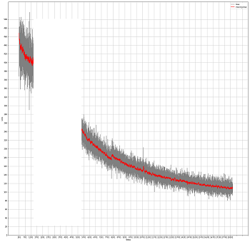
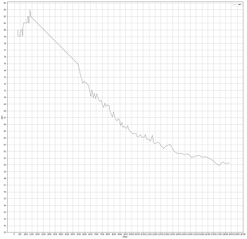

# Deep Speech - implementation of 1412.5567v2 19 Dec 2014 article

This is simple and strightforward implementation in a very few program files:

- prepare_libri.py preprocesses Libri datasets and outputs in tfrecords format in local file system. Generally, idea was that Google's TPU is used for training. TPU can access data located in Google storage, so tfrecord output files have to be manually copied into Google storage
- training.py is a training program implemented in tensorflow (1.14)
- utils.py contains alphabet to index and index to alpabet mapping
- constants.py defines locations of training, testing and logs. tfrecords and logs can be located locally or on Google storage. TPU requires tfrecords located in Google storage, so TPU can access them. This file is relevant to training only and it has to be adjusted. This avoid editing training.py

## Preparing data

Files preparation:
1. Unzip Libri. I used only Libri train-clean-100, train-clean-360 and test-clean
2. prepare_libri can split tfrecords. 100k samples will be split into 4 files: 30k, 30k, 30k, 10k if partition size is 30k

Processing:
1. librosa is used to read flac files directly without transforming to wav. Sample rate is 16,000, window 20ms, step 10ms, 80 bins
2. python_speech_features package is used to get filterbank energies
I used preemp 0. and kept logarithm value >= 0 for whatever reason. I do not think it is necessary, so just preempt just set to regular 0.97 and logariphm is not constrained to positive values
3. Values are normalized within sample per bin
4. Sample is padded with zeros to max_sequence_length
5. Tensor is transformed as frequency, time, channel (1)
6. tfrecord attributes are feature, feature length, label, label length - they will be needed in training.py

Sample command: 
python prepare_libri.py --max_sequence_length=1729 --max_label_length=338 --partition_size=30000 --starting_position=0 --logging=INFO --files_path=data/Libri/LibriSpeech/train-clean-360 --tfrecords_file=data/train-clean-360.tfrecords

Parameter notes (see all parameters in prepare_libri.py):
- starting_position - this allows to restart processing if previous processing was interrupted
- partition_size=30000 - it will break otherwise single tfrecords file into chunks, here 30000 each 
- max_sequence_length value is 1729. It is selected based on lengths of libri-train-clean-100. There are few samples beyond 1729 in this dataset. Also, max_sequence_length impacts size in convolutions and RNN length. Longes samples are discarded. Probably, this value can be better adjusted based on what libri-train-clean-360 lengths are. max_label_length is just max length of label from selected samples.
- logging=DEBUG shows feature values

After train and test data is prepared, optionally copy files to Google's storage:

gsutil -m cp data/*.tfrecords.* gs://robotic-gasket-999999.appspot.com/data
- 999999 - this with be specific to your storage

## Training

Program Flow:

1. Defining tfrecorddataset and iterator
2. Defining model
3. Defining ctc_loss, optimizer (Adam) and training op
4. Providing ctc beam search
5. Loop for traning and testing

1. Model is fed from tfrecord dataset. It is simple and efficient mechanism without doing much custom development as it is usually done. tf.data.dataset provides provides inteveave, shuffle, prefetch, map options removing burdent doing this manually. It is more efficient compare to feed dictionary. All prepare_libri tfrecord files are fed during traning. We switching traning and testing during the traning
2. Model is defined as per article:
- 3 convolutional layers: stride 2 in time dimention of first layer, context 5 (5\*2+1=11), input is batch, frequency (bins), time (frames), channel, clipped relu (issue with bfloat16 discussed later)
- bidirectional RNN: implemented with while_loop and simplernncell, dropout should be 5-10%, recurrent unit size 512, both outputs are summed, but could be concatenated as it seems can preserve more information
- dense layer: size is number of classes including blank (29 total size)
- model returns both linear and softmax. Linear output is needed for ctc_loss function
3. ctc_loss:
- sequence lengths are recalculated due to stride 2 in convolutuions
- labels provided as sparse tensor and implemented as while_loop (there is somewhere impementation available already)
- logits are linear data in form of time, batch, probabilities
- adam optimizer, learning rate I used constant 0.0003, but configurable to reduce by factor on evry epoch
- gradient clipping works on float32
4. beam serch provides the best over the whole sentense estimates. Beam search output is used for wer calculation
5. Training and testing
- Article says to loop over 10-15 epochs. To calculate epochs as well as testing batches accurate training_set_size and testing_set_size parameters are needed
- training runs wit CPU or TPU
- mixed bfloat16 can be used. bfloat16 is enabled on convolutions only, RNN did produce any speed improvement
- to run training and testing, dataset is switched
- testing invokes beam search, jiwer wer package is used to calculate error rate

Mixed presision training:
bfloat16 calculates faster in some cases. 

- I enable it on convolutions only, RNN did not produce any speed improvement
- bfloat16 in not fully fixed in tensorfliow 1.14. tf.maximum uses less_equal op and is has a bug with double registration which will be fixed in post 1.14. So I put just relu6 to make it work
- I was not able to overcome nan loss if I use bfloat16. This need to be looked some into. Could be relu6 compare to relu20

Command line sample (see all parameters in training.py):

python training.py --max_sequence_length=1729 --max_label_length=338 --training_set_size=132492 --testing_set_size=2472 --trace_interval=2 --save_interval=2 --test_interval=5 --shuffle_buffer_size=150000 -tpu --tpu_name='node-8' --learning_rate=0.0003 --learning_rate_decay_factor=1. --bfloat16

- max_sequence_length, max_label_length should be same as in prepare_linri
- training_set_size, testing_set_size should be accurate for epochs calculation
- save_interval - to prevent loss of trained models
- test_interval - longer itervals save time, progress can be judged by loss
- learning rate formula: learning_rate / (learning_rate_decay_factor\*\*epoch), use factor 1 to keep lr the same

Debug:
- use logging=DEBUG to enable extensive output
- I used debug to see features, projections, gradients. Also, anything else can be added such as to see convolutions weigths or outputs

Loss, wer and test output samples:

- ctc loss - I removed some part of the image. It was due to wrong training parameters

- wer - this is how far I went. I the article they used more data for training. train-other-500 can be added into traning set 

- output sample:

